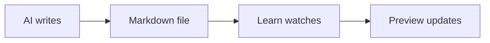

# Fractions, from the ground up

We’ll start with sharing, then connect that idea to division, decimals, and percentages.

> [!abstract] A useful connection
>
> A fraction is not only a piece of something. It is also a division waiting to happen: **¾ means 3 ÷ 4.**

> [!quiz] Quick check
>
> You have 12 candies and 3 friends. Which operation finds each friend’s equal share?
>
> - **1.** 12 − 3
> - **2.** 12 ÷ 3
> - **3.** 3 ÷ 12
> - **4.** 12 + 3

> [!answer] Your selections
>
> - **2.** Doing the arithmetic
> - **5.** Fractions as division / decimals / percents

> [!note] What we’ll do next
>
> We’ll use a small number line to make the division connection visible before adding any rules.

> [!question] Think about it
>
> Why does sharing 12 equally between 3 friends produce the same operation as the fraction $\frac{12}{3}$?

> [!success] Correct
>
> Dividing 12 by 3 gives each friend 4 candies.

## Math that belongs on the page

Einstein's mass-energy equivalence is $E = mc^2$. Display equations get room to breathe:

$$
\int_0^1 x^2\,dx = \frac{1}{3}
$$

## Ideas as diagrams



## Code, clearly

```typescript
const preview = await open("lesson.md");
preview.watch();
```

> The interface gets out of the way. The lesson stays in view.

| Feature | Included |
| --- | :---: |
| Live reload | ✓ |
| GitHub-flavored Markdown | ✓ |
| Math and diagrams | ✓ |
